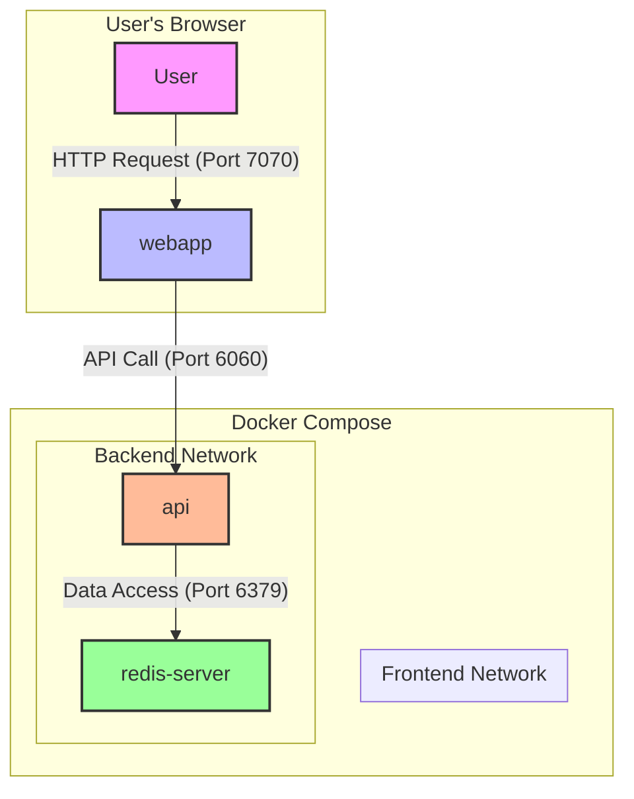

# Docker Compose is useful for development
> This is a simple demo of using Docker Compose project to run a Node.js app with a Redis database.

## Architecture Diagram



## Start the project

Start the project with Docker Compose:
```bash
cd 01-docker-compose-web-app
docker compose up --build
```

open the webapp http://localhost:7070/

Then go to Docker Desktop and:

- Show the running compose stack
- Then **Add data to the Redis database**

```bash no-run-button
redis-cli
```

```bash no-run-button
SET hamster 12
SET panda 12
SET tiger 68
SET fox 20
```

## Activate the watch mode

> TODO: explain the watch mode

Stop docker compose (CTRL+C) and restart it with the watch mode:

In another terminal
```bash
cd 01-docker-compose-web-app
docker compose down
docker compose up --watch
```

Change something in `/web/templates/index.ejs`, for example the main title:

```html
<p class="title is-1">
All things 🐳 Compose
</p>
```

Then return to [http://localhost:7070/](http://localhost:7070/) and refresh the page to see the changes.