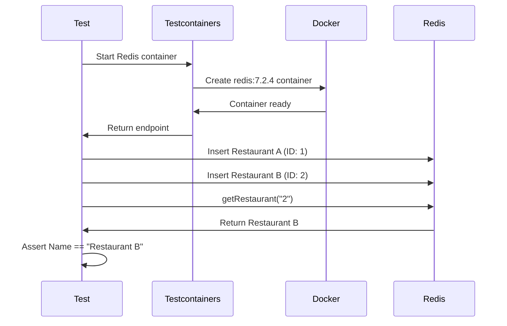
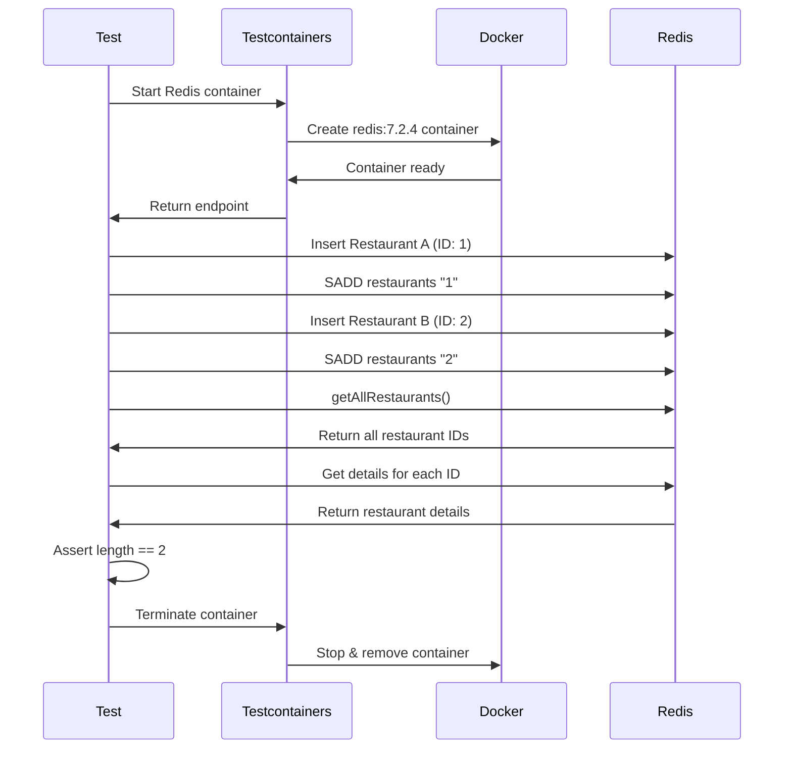

# Testing with Testcontainers

This document explains how the integration tests work using Testcontainers to test Redis interactions.

## Overview

The tests use [Testcontainers for **Golang**](https://golang.testcontainers.org/) to spin up real Redis containers during testing. This ensures tests run against actual Redis instances **rather than mocks**, providing **more reliable integration testing**.

## Test 1: TestGetRestaurant

This test validates retrieving a single restaurant by ID from Redis.

```bash
cd 03-go-web-app-demo
go test -v -run TestGetRestaurant
```

### Flow



### Steps

1. **Container Setup**: Testcontainers creates a Redis 7.2.4 container
2. **Data Population**: Two restaurants are inserted into Redis using `HSet`
   - Restaurant A (ID: 1)
   - Restaurant B (ID: 2)
3. **Retrieval**: The `getRestaurant()` function fetches restaurant with `ID "2"`
4. **Validation**: Assert the returned restaurant name is `"Restaurant B"`

### Redis Commands Used

```
HSET restaurant:1 name "Restaurant A" address "123 Main St" ...
HSET restaurant:2 name "Restaurant B" address "456 Elm St" ...
HGETALL restaurant:2
```

## Test 2: TestGetAllRestaurants

This test validates retrieving all restaurants from Redis.

```bash
cd 03-go-web-app-demo
go test -v -run TestGetAllRestaurants
```

### Flow



### Steps

1. **Container Setup**: Testcontainers creates a Redis 7.2.4 container
2. **Data Population**: Two restaurants are inserted with an additional step:
   - Insert restaurant data using `HSet`
   - Add restaurant ID to a set using `SAdd`
3. **Retrieval**: The `getAllRestaurants()` function:
   - Fetches all IDs from the `"restaurants"` set
   - Retrieves details for each `ID`
4. **Validation**: Assert exactly 2 restaurants are returned
5. **Cleanup**: Container is explicitly terminated

### Redis Commands Used

```
HSET restaurant:1 name "Restaurant A" address "123 Main St" ...
SADD restaurants "1"
HSET restaurant:2 name "Restaurant B" address "456 Elm St" ...
SADD restaurants "2"
SMEMBERS restaurants
HGETALL restaurant:1
HGETALL restaurant:2
```

## Running the Tests with Docker Model Runner

```bash
cd 03-go-web-app-demo
go test -v -run TestHawaiianPizzaExpert
```

## Benefits of Testcontainers

1. **Real Dependencies**: Tests run against actual Redis, not mocks
2. **Isolation**: Each test gets a fresh Redis instance
3. **Portability**: Tests work anywhere Docker is available
4. **Automatic Cleanup**: Containers are removed after tests complete
5. **Reproducibility**: Consistent behavior across environments
