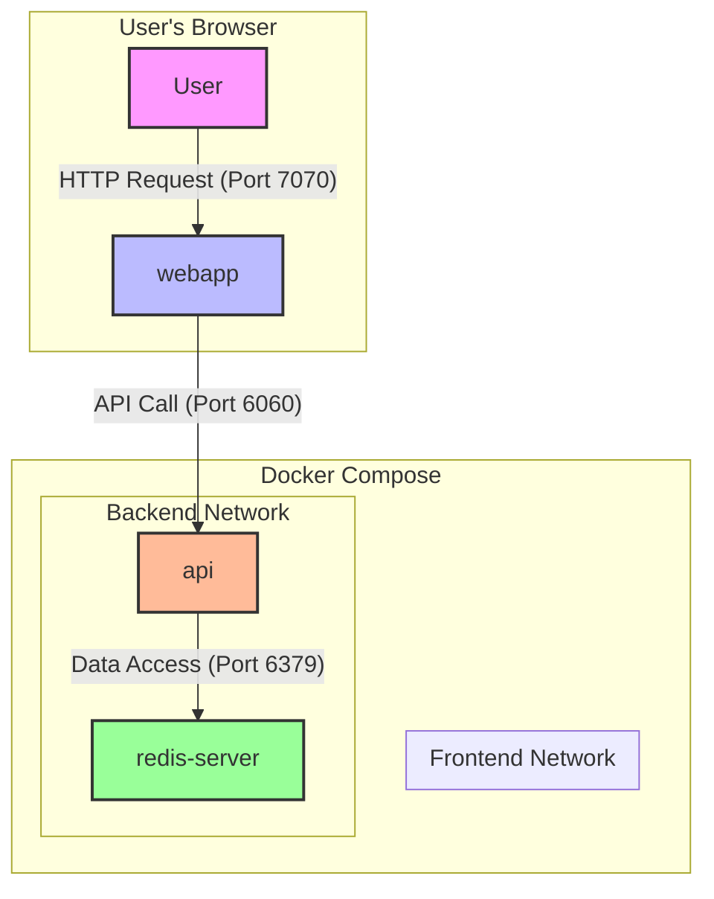

# Docker 101
> This is a simple demo of using Docker Compose project to run a Node.js app with a Redis database.
## Docker Compose is useful for development

### Initialize the project

Start the project with Docker Compose:
```bash
docker compose up --build
```

Then go to Docker Desktop and:

- Show the running compose stack
- Then **Add data to the Redis database**

```bash
redis-cli

SET hamster 12
SET panda 12
SET tiger 68
SET fox 20
```

### Activate the watch mode

> TODO: explain the watch mode

Stop docker compose (CTRL+C) and restart it with the watch mode:

```bash
docker compose up --watch
```

Change something in `/web/templates/index.ejs`, for example the main title:

```html
<p class="title is-1">
All things 🐳 Compose
</p>
```

Then return to [http://localhost:7070/](http://localhost:7070/) and refresh the page to see the changes.

## Architecture Diagram


