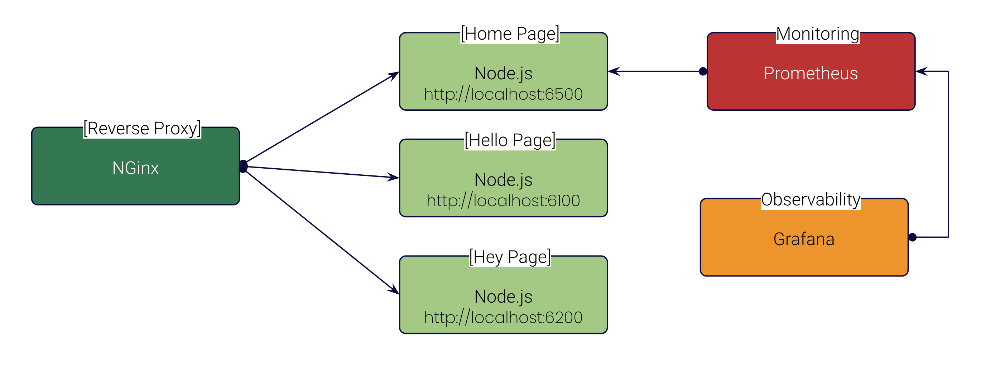
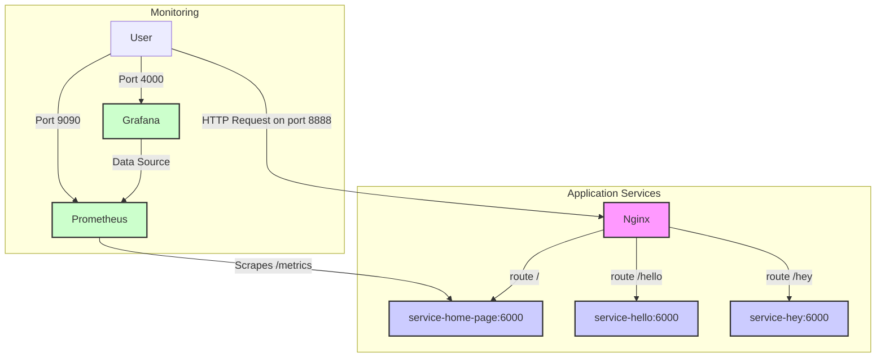

# Docker 101

## Docker Compose is useful for multi-container applications

### I need microservices, monitoring, and a reverse proxy



### Architecture diagram




```bash
docker compose up
```

#### Open the Web application

- home: http://localhost:8888
- hello: http://localhost:8888/hello
- hey: http://localhost:8888/hey

✋ **The links to Prometheus and Grafana are on the home page**

**Dashboard**: http://localhost:4000/d/O4gR7H5Iz/k33g_dashboard?orgId=1&refresh=5s

#### Open the Web application pages with different ports

- home: http://localhost:6500
- hello: http://localhost:6100
- hey: http://localhost:6200