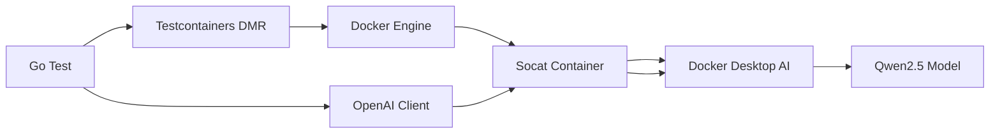
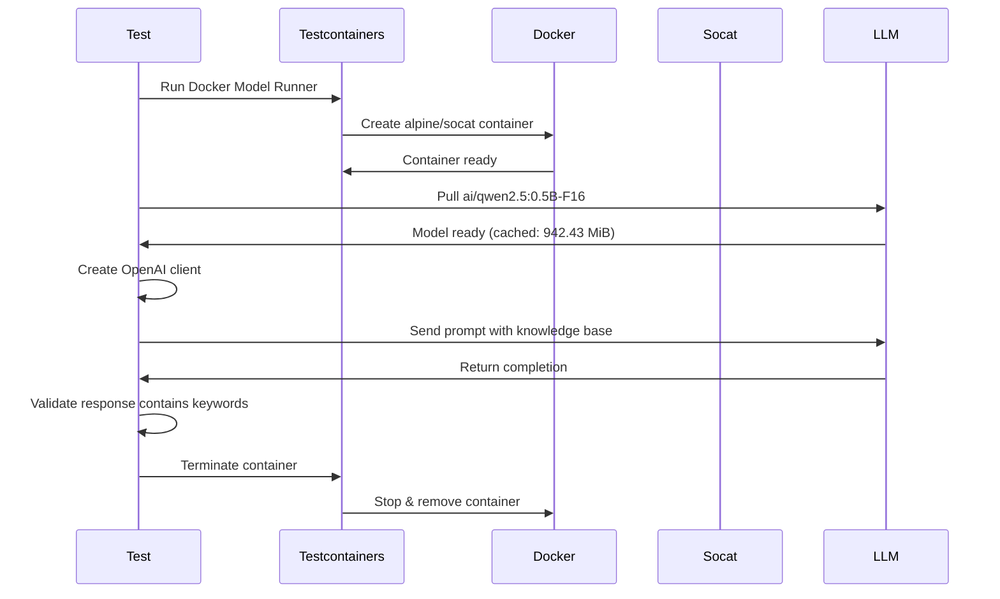
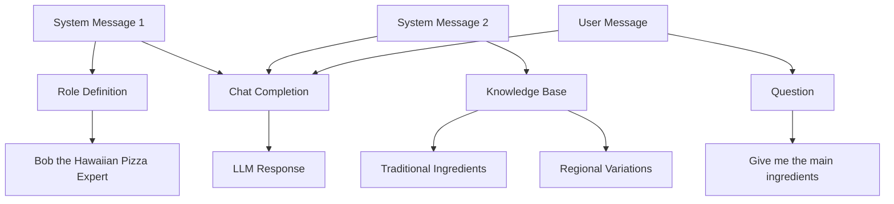
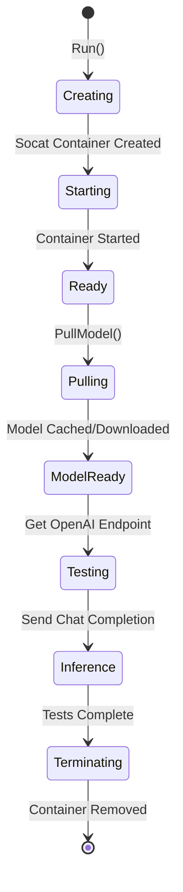

# Testing LLM with Docker Model Runner

This document explains how the LLM integration test works using Testcontainers Docker Model Runner to test AI model interactions.

## Overview

The test uses [Testcontainers Docker Model Runner](https://golang.testcontainers.org/modules/dockermodelrunner/) to spin up a local LLM container during testing. This module provides an OpenAI-compatible API endpoint for running AI models locally using Docker Desktop's built-in AI capabilities.

## Test Architecture



## Test: TestHawaiianPizzaExpert

This test validates that an LLM can correctly answer questions about Hawaiian pizza based on a provided knowledge base.

### Flow



### Steps

1. **Container Setup**: Testcontainers creates a Socat container (alpine/socat:1.8.0.1) that proxies requests to Docker Desktop AI
2. **Model Pull**: Downloads the `ai/qwen2.5:0.5B-F16` model (942.43 MiB)
   - Uses cached version if available
3. **Client Setup**: Creates an OpenAI-compatible client pointing to the local endpoint
4. **Prompt Construction**: Builds a multi-message prompt:
   - System message: Defines the AI as "Bob", a Hawaiian pizza expert
   - Knowledge base: Provides structured information about ingredients and variations
   - User message: Asks for main ingredients
5. **LLM Inference**: Sends the prompt to the model with temperature=0.0 (deterministic)
6. **Validation**: Checks that the response contains expected keywords:
   - "cheese"
   - "bacon"
   - "pineapple"
7. **Cleanup**: Container is terminated and removed

### Model Configuration

```go
Model: ai/qwen2.5:0.5B-F16
Temperature: 0.0 (deterministic output)
API: OpenAI-compatible
Endpoint: http://localhost:<random-port>/engines/v1
```

## Prompt Structure



### System Message 1: Expert Definition
- Name: Bob
- Role: Hawaiian pizza expert
- History: Canadian origin (1962, Sam Panopoulos)
- Tone: Friendly with pizza puns
- Behavior: Defend pineapple on pizza good-naturedly

### System Message 2: Knowledge Base
Provides structured information:
- **Traditional ingredients**: dough, tomato sauce, mozzarella, ham, pineapple
- **Regional variations**: Australian, Brazilian, Japanese, German, Swedish versions

### User Message
Simple question: "give me the main ingredients of the Hawaiian pizza"

## Docker Model Runner Lifecycle



### Key Components

- **Socat Container**: Acts as a proxy between the test and Docker Desktop AI engine
- **Ryuk Container**: Automatically started for cleanup (testcontainers/ryuk:0.11.0)
- **Model Caching**: Models are cached locally to speed up subsequent runs
- **OpenAI Compatibility**: Uses standard OpenAI Go SDK for communication

## Expected Response

The LLM should return a response containing:

```
The main ingredients of a Hawaiian pizza are:

- Base: Traditional pizza dough
- Sauce: Tomato-based pizza sauce
- Cheese: Mozzarella cheese
- Key Toppings: Ham (or Canadian bacon) and pineapple
```

## Running the Test

```bash
# Run the LLM test
go test -v -run TestHawaiianPizzaExpert

# Run all tests
go test -v
```

### Prerequisites

- Docker Desktop with AI features enabled
- Sufficient disk space for model downloads (~1 GB)
- Internet connection (first run only, for model download)

## Test Output Explained

The test logs show:
1. **Connection**: Docker Desktop connection details
2. **Container Creation**: Socat and Ryuk container events
3. **Model Pull**: Download or cache usage (942.43 MiB)
4. **Endpoint**: Local URL for OpenAI-compatible API
5. **Response**: LLM-generated answer with emoji indicator 🐳🤖
6. **Cleanup**: Container termination events

## Benefits of Docker Model Runner

1. **Local Testing**: Run LLMs locally without external API dependencies
2. **Cost-Free**: No API costs for testing
3. **Fast Iteration**: Cached models enable quick test runs
4. **Reproducibility**: Same model version across all test runs
5. **Privacy**: Data never leaves your machine
6. **OpenAI Compatible**: Use familiar OpenAI SDK patterns
7. **Automatic Cleanup**: Containers removed after tests complete

## Model Details

- **Model**: Qwen 2.5 (0.5B parameters, F16 precision)
- **Size**: ~942 MB
- **Provider**: Alibaba Cloud
- **Use Case**: Lightweight general-purpose chat model
- **Temperature**: 0.0 for deterministic, reproducible results

## Validation Strategy

The test uses keyword validation rather than exact string matching:
- Flexible: Handles minor variations in LLM output
- Robust: Focuses on semantic content (ingredients mentioned)
- Simple: Easy to understand and maintain

```go
expectedWords := []string{"cheese", "bacon", "pineapple"}
```

This approach ensures the LLM understood the knowledge base and extracted the correct information without requiring exact output matching.
